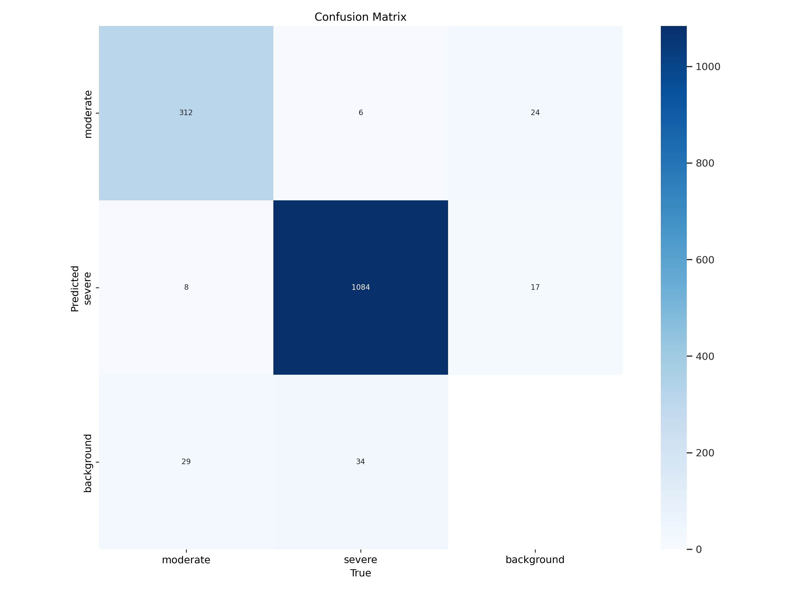
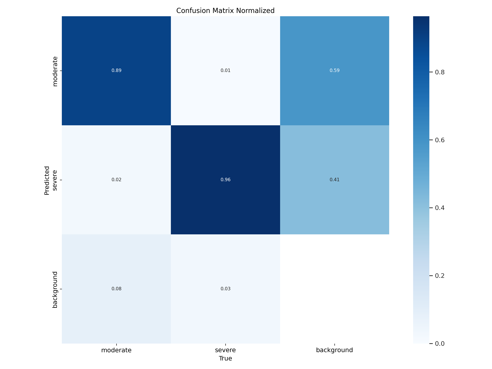
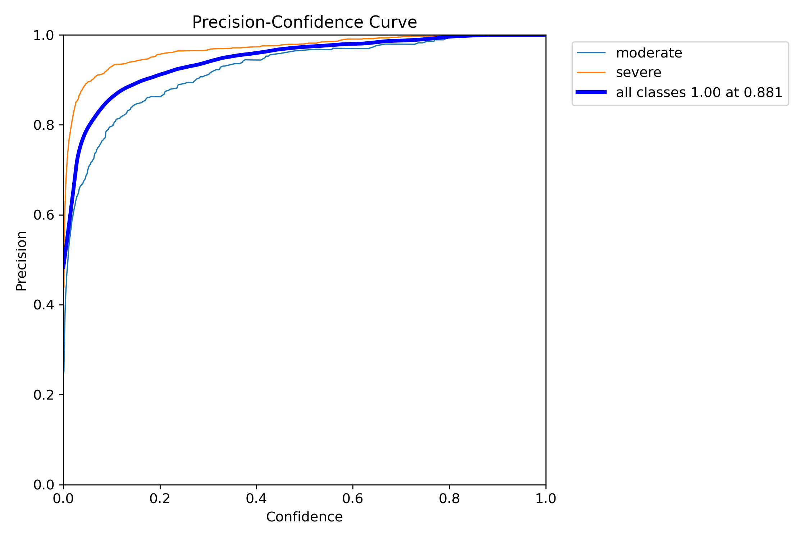
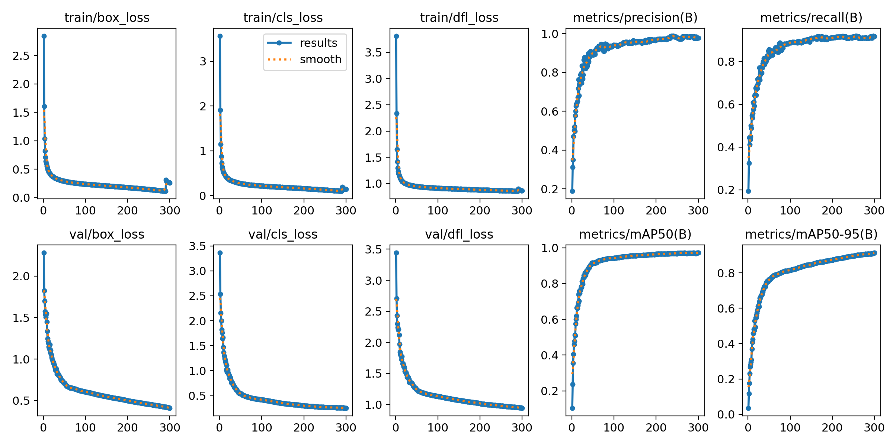
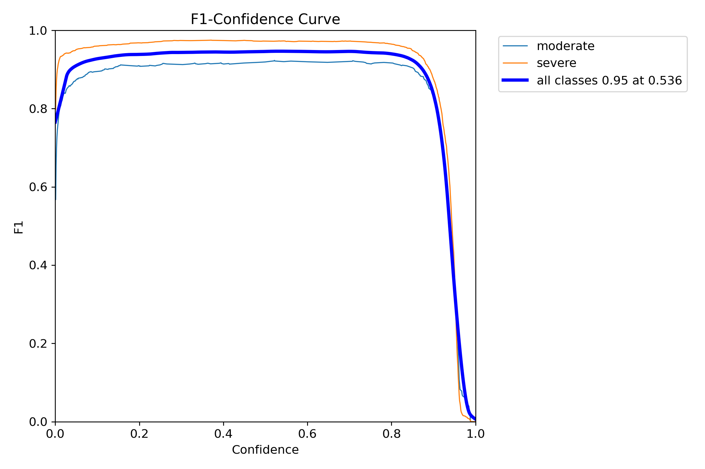
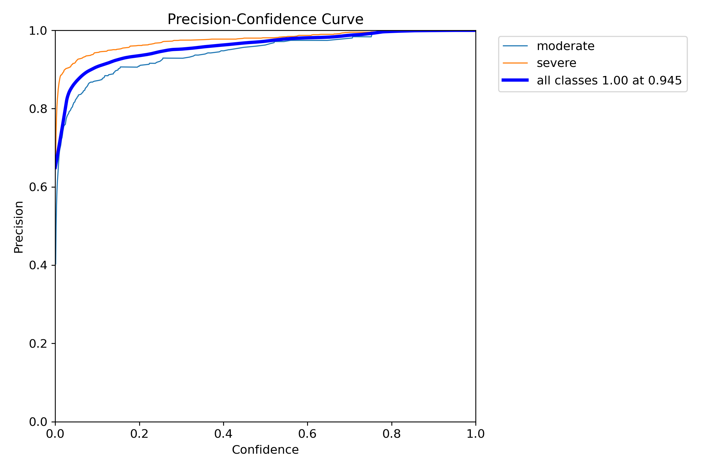
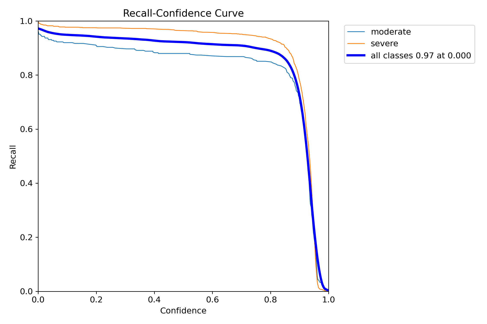
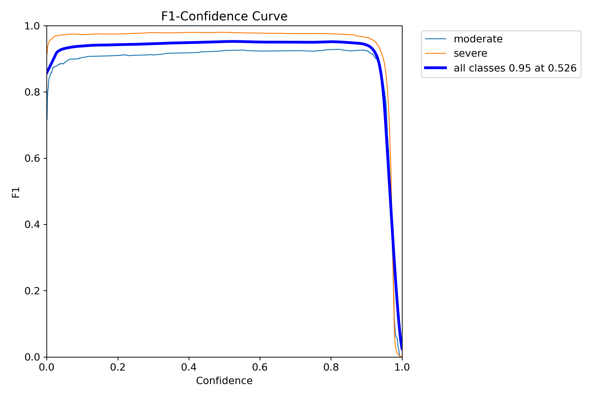

# Training object detector for road accidents detection

## Table of Contents
- [About](#about)
- [Pretrained models](#pretrained-models)
- [Usage](#usage)
- [References](#references)

## About
It is just bunch of scripts to train road accidents detector for my pet-project written in Rust programming languages: https://github.com/LdDl/road-anomaly-detection

There are two scripts in this repository:
- `download.py` to download dataset of interest;
- `train.py` to run training process; (w.i.p)

## Pretrained models

If you want just to download pretrained models here are links:
- YOLOv8 nano - [Best weights (ONNX)](https://github.com/LdDl/road-anomaly-detection-train/releases/download/v0.2.0/best_nano.onnx), [Best weights (Pytorch)](https://github.com/LdDl/road-anomaly-detection-train/releases/download/v0.2.0/best_nano.pt) [Last weights (Pytorch)](https://github.com/LdDl/road-anomaly-detection-train/releases/download/v0.2.0/last_nano.pt)
  Parameters:
  - Image size: 608x608
  - Batch size: 16
  - Epochs: 300
  - Cache images: yes

  <details>
    <summary>Training results (images, CSV)</summary>
    
    Training and validation batches examples are [here](runs/detect/nano/)

    |  | 
    |:--:| 
    | Results . Corresponding CSV is [here](runs/detect/nano/results.csv) |

    |  | 
    |:--:| 
    | *Confusion matrix* |

    |  | 
    |:--:| 
    | *Normalized confusion matrix* |
  
    |  | 
    |:--:| 
    | *F1 Curve* |

    |  | 
    |:--:| 
    | *P Curve* |

    |  | 
    |:--:| 
    | *R Curve* |

    |  | 
    |:--:| 
    | *PR Curve* |

    |  | 
    |:--:| 
    | *Labels* |

    |  | 
    |:--:| 
    | *Labels correlogram* |

  </details>

- YOLOv8 nano - [Best weights (ONNX)](https://github.com/LdDl/road-anomaly-detection-train/releases/download/v0.2.0/best_small.onnx), [Best weights (Pytorch)](https://github.com/LdDl/road-anomaly-detection-train/releases/download/v0.2.0/best_small.pt) [Last weights (Pytorch)](https://github.com/LdDl/road-anomaly-detection-train/releases/download/v0.2.0/last_small.pt)

  Parameters:
  - Image size: 608x608
  - Batch size: 16
  - Epochs: 300
  - Cache images: yes

  <details>
    <summary>Training results (images, CSV)</summary>
    
    Training and validation batches examples are [here](runs/detect/small/)

    |  | 
    |:--:| 
    | Results . Corresponding CSV is [here](runs/detect/small/results.csv) |

    |  | 
    |:--:| 
    | *Confusion matrix* |

    |  | 
    |:--:| 
    | *Normalized confusion matrix* |
  
    |  | 
    |:--:| 
    | *F1 Curve* |

    |  | 
    |:--:| 
    | *P Curve* |

    |  | 
    |:--:| 
    | *R Curve* |

    |  | 
    |:--:| 
    | *PR Curve* |

    |  | 
    |:--:| 
    | *Labels* |

    |  | 
    |:--:| 
    | *Labels correlogram* |

  </details>

- YOLOv8 medium - @todo train
- YOLOv8 large - @todo train
- YOLOv8 extra large - [Best weights (ONNX)](https://github.com/LdDl/road-anomaly-detection-train/releases/download/v0.2.0/best_small.onnx), [Best weights (Pytorch)](https://github.com/LdDl/road-anomaly-detection-train/releases/download/v0.2.0/best_small.pt) [Last weights (Pytorch)](https://github.com/LdDl/road-anomaly-detection-train/releases/download/v0.2.0/last_small.pt)

  Parameters:
  - Image size: 608x608
  - Batch size: 16
  - Epochs: 300
  - Cache images: yes

  <details>
    <summary>Training results (images, CSV)</summary>
    
    Training and validation batches examples are [here](runs/detect/extra_large/)

    |  | 
    |:--:| 
    | Results . Corresponding CSV is [here](runs/detect/extra_large/results.csv) |

    |  | 
    |:--:| 
    | *Confusion matrix* |

    |  | 
    |:--:| 
    | *Normalized confusion matrix* |
  
    |  | 
    |:--:| 
    | *F1 Curve* |

    |  | 
    |:--:| 
    | *P Curve* |

    |  | 
    |:--:| 
    | *R Curve* |

    |  | 
    |:--:| 
    | *PR Curve* |

    |  | 
    |:--:| 
    | *Labels* |

    |  | 
    |:--:| 
    | *Labels correlogram* |

  </details>

## Usage
* Clone the repository and navigate to root folder:
  ```shell
  git clone https://github.com/LdDl/road-anomaly-detection-train.git
  cd road-anomaly-detection-train
  ```

* Install dependencies
  ```shell
  pip3 install -r requirements.txt
  ```

* Navigate to selected dataset. In this case the link is:
  ```
  https://universe.roboflow.com/accident-detection-ffdrf/accident-detection-8dvh5
  ```

  Click `Download` button:

  

* Navigate to `Terminal` tab and get dataset ID and unique key to download it.

  

* Run `download.py` script
  ```shell
  export DATASET_ID=YOUR-DATASET-ID
  export ROBOFLOW_KEY=YOUR-ACCOUNT-KEY
  
  python3 download.py --dataset_id $DATASET_ID --key $ROBOFLOW_KEY --output dataset.zip
  ```

  You can adjust classes if you need to in lines [119](download.py#L119) and [124](download.py#L124):
    - Undefined classes would be marked as (max class ID + 1).
    - Warning: Re-labeled annotations would be stored in `/train/labels`, `/test/labels` and `/valid/labels`. Source labels would be stored in `/train/labels_source`, `/test/labels_source` and `/valid/labels_source` respectively.


* Run `train.py` script
  ```shell
  python3 train.py --cache_images t --model_size n --image_size 608 --yaml_path extracted_dataset --batch_size 16 --epochs 300
  ```

  When training is done you can extract both ONNX and Pytorch weights from `run` directory which would be generated during training process.

## References
* Developers of YOLOv8 - https://github.com/ultralytics/ultralytics. If you are aware of some original papers for YOLOv8 architecture, please contact me to mention it in this README.
* Dataset source https://universe.roboflow.com/accident-detection-ffdrf/accident-detection-8dvh5
